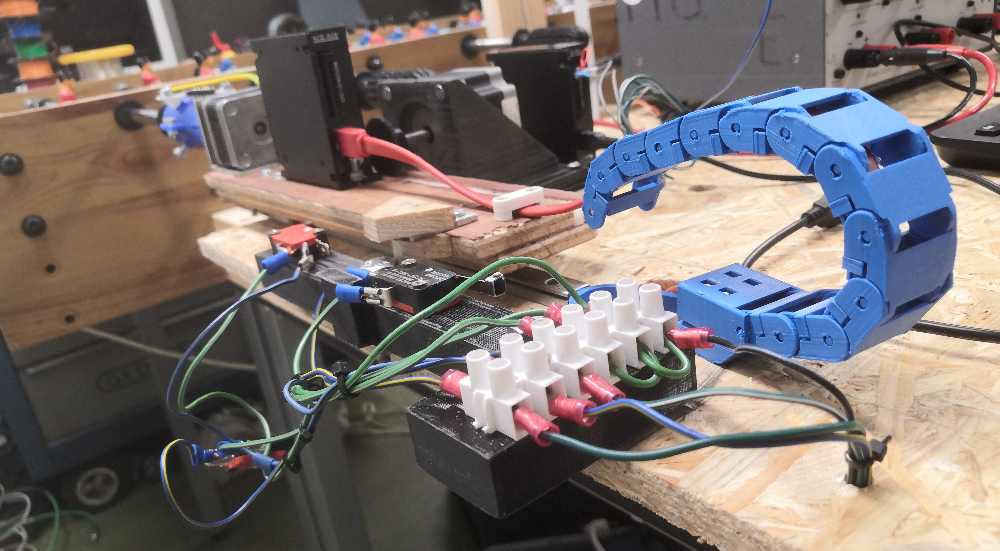

# FoosTronics Extra
> Extra bestanden die benodigd zijn om de FoosTronics tafel te realiseren.

## Mappen
**3D-Modellen** 
  STL files van de 3D-prints.
  
**3D-Tekeningen** 
  SLDPRT (SolidWorks) en SKP (SketchUp) files die zijn gebruikt voor het project.
  

**Promo**
  Promo bestanden zoals afbeeldingen en logo.
  
## Files
Handleiding voor het installeren van de FoosTronics tafel - *Handleiding FoosTronics - V1.1.pdf* 
  
## Constructie

